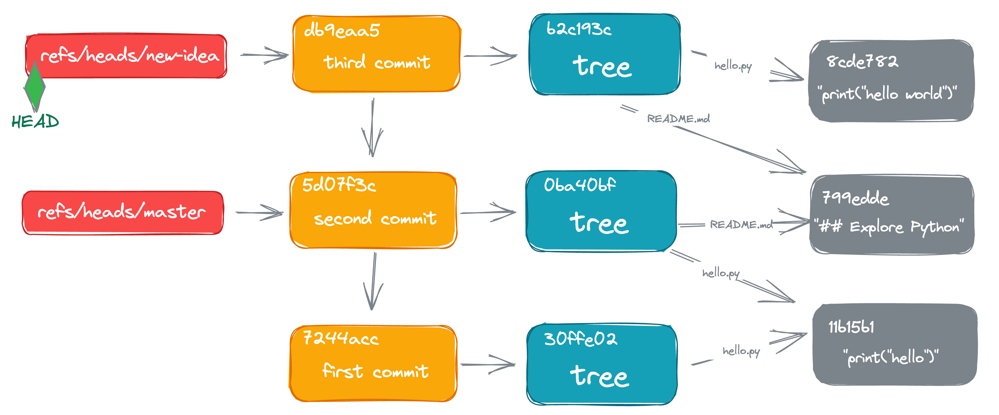

# Explore Git

Curious about how Git works.

go to https://explore-git.sorosliu.xyz/ for detailed explanation.

## references
- [Git Internals](https://git-scm.com/book/en/v2/Git-Internals-Plumbing-and-Porcelain)  
  take a peek into the internals of Git
- [Hacking Git - Object storage format](https://git-scm.com/docs/user-manual#object-details)  
  Git object format, in bytes
- [The Git Parable](https://tom.preston-werner.com/2009/05/19/the-git-parable.html)  
  design VCS from scratch, the design philosophy behind Git
- [The Git Parable, with illustrations](http://practical-neuroimaging.github.io/git_parable.html)  
  same as [Git Parable], with nice illustrations
- [Design Git-like content management system](https://matthew-brett.github.io/curious-git/curious_journey.html)  
  like [Git Parable], design a content management system (Git is basically a content management system)
- [Git Index file format](https://git-scm.com/docs/index-format/2.25.0)  
  Official document for index file format
